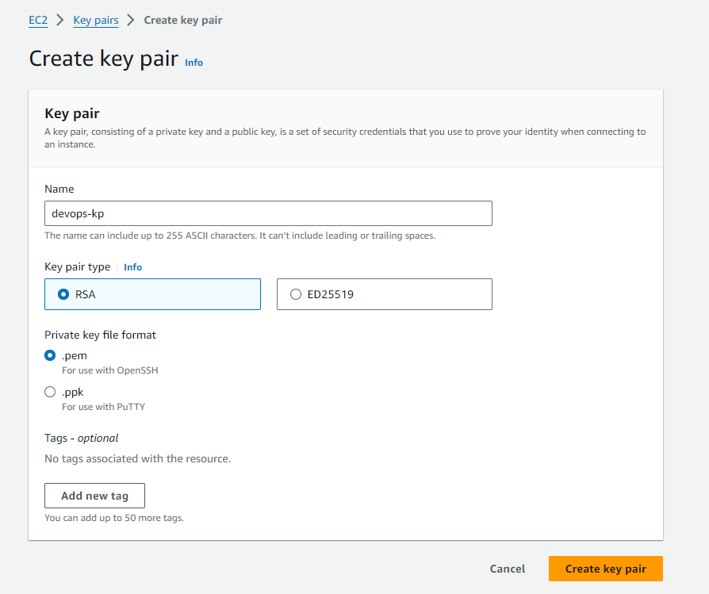

# Create a Key pair

- name of the **key pair** should be **devops-kp**
- keypair type must be **rsa**

## Solution

1. Open the Amazon EC2 console at https://console.aws.amazon.com/ec2/.

2. In the navigation pane, under **Network & Security**, choose Key Pairs.

3. On the Key Pairs page, choose Create **Key Pair**.

4. For Key pair name, type a name that is easy for you to remember, and then choose Create.

5. When the console prompts you to **save the private key file**, save it in a safe place.

