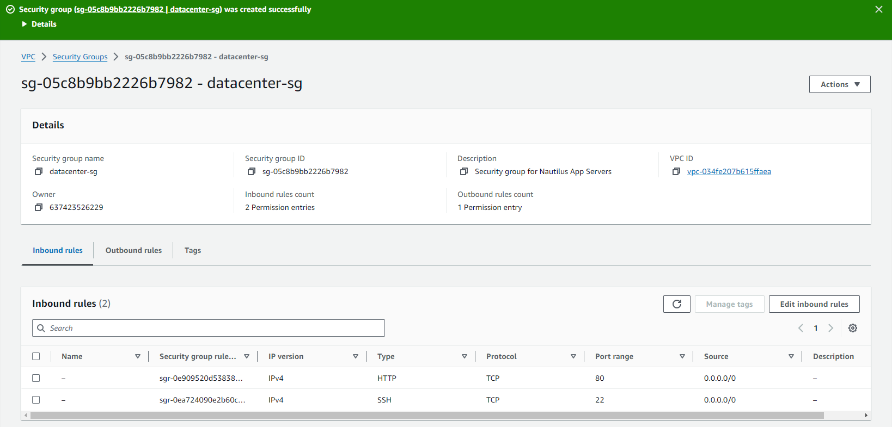

# Create a security group under default VPC

**Requirements**

- Name of the **security group** is **datacenter-sg**.
- The *description* must be **Security group for Nautilus App Servers**
- Add the inbound rule of type **HTTP**, with port range of **80**. Enter the source CIDR range of **0.0.0.0/0**.
- Add another inbound rule of type SSH, with port range of **22**. Enter the source CIDR range of **0.0.0.0/0**

## Solution

1. Open the Amazon EC2 console at https://console.aws.amazon.com/ec2/.

2. In the navigation pane, under **Network & Security**, choose Key Pairs.

3. On the **Security Groups** page click on create security group

4. Add sg name, description and choose VPC
5. Add Inbound rules for **HTTP & SSH**

