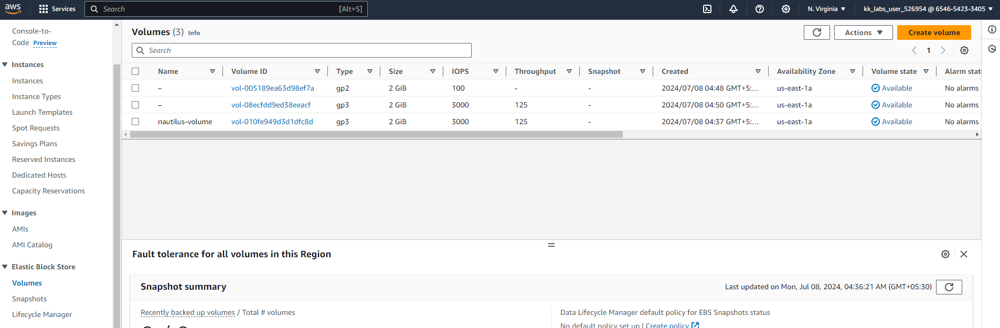

# Create GP3 Volume

**Requirements**

- Name of the volume should be nautilus-volume.

- Volume type must be gp3.

- Volume size must be 2 GiB

## Solution

1. Open the Amazon EC2 console at https://console.aws.amazon.com/ec2/.

2. In the navigation pane, under **Elastic Block Store**, choose volumes.

3. 3. On the **Volumes** page click on create volume




## Commands
```
~ on ☁️  (us-east-1) ✖ aws ec2 create-volume --availability-zone us-east-1a --size 2 --volume-type gp3 
{
    "AvailabilityZone": "us-east-1a",
    "CreateTime": "2024-07-07T23:20:40.000Z",
    "Encrypted": false,
    "Size": 2,
    "SnapshotId": "",
    "State": "creating",
    "VolumeId": "vol-08ecfdd9ed38eeacf",
    "Iops": 3000,
    "Tags": [],
    "VolumeType": "gp3",
    "MultiAttachEnabled": false,
    "Throughput": 125
}
```
```
aws ec2 describe-volumes --volume-ids vol-010fe949d3d1dfc8d
```