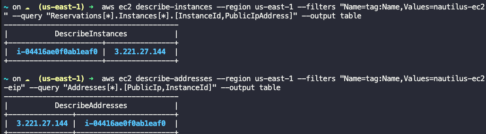

# Elastic Ip - Ec2 Instance

## Scenerio
There is an instance named nautilus-ec2 and an elastic-ip named nautilus-ec2-eip in us-east-1 region. Attach the nautilus-ec2-eip elastic-ip to the nautilus-ec2 instance

1. Get the Instance ID of nautilus-ec2:
First, we need to find the instance ID of the nautilus-ec2 instance using the tag name.

```
aws ec2 describe-instances --region us-east-1 --filters "Name=tag:Name,Values=nautilus-ec2" --query "Reservations[*].Instances[*].InstanceId" --output text
```
2. Get the Allocation ID of the nautilus-ec2-eip Elastic IP:
```
aws ec2 describe-addresses --region us-east-1 --filters "Name=tag:Name,Values=nautilus-ec2-eip" --query "Addresses[*].AllocationId" --output text
```
3. Associate the Elastic IP with the Instance:
```
aws ec2 associate-address --region us-east-1 --instance-id <Instance_ID> --allocation-id <Allocation_ID>
```

```
# Get the Instance ID of nautilus-ec2
INSTANCE_ID=$(aws ec2 describe-instances --region us-east-1 --filters "Name=tag:Name,Values=nautilus-ec2" --query "Reservations[*].Instances[*].InstanceId" --output text)

# Get the Allocation ID of the nautilus-ec2-eip Elastic IP
ALLOCATION_ID=$(aws ec2 describe-addresses --region us-east-1 --filters "Name=tag:Name,Values=nautilus-ec2-eip" --query "Addresses[*].AllocationId" --output text)

# Associate the Elastic IP with the Instance
aws ec2 associate-address --region us-east-1 --instance-id $INSTANCE_ID --allocation-id $ALLOCATION_ID
```

## How to Verify

1. Describe the Instance and Check the Public IP:
```
aws ec2 describe-instances --region us-east-1 --filters "Name=tag:Name,Values=nautilus-ec2" --query "Reservations[*].Instances[*].[InstanceId,PublicIpAddress]" --output table
```

2.Describe the Elastic IP and Check the Association:
```
aws ec2 describe-addresses --region us-east-1 --filters "Name=tag:Name,Values=nautilus-ec2-eip" --query "Addresses[*].[PublicIp,InstanceId]" --output table
```


