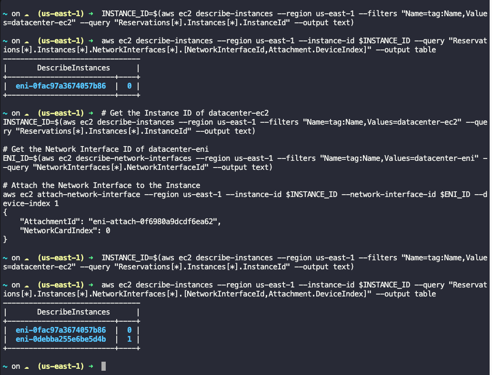

# Add Elastic Network interface to an Ec2 Instance

- An instance named datacenter-ec2 and an elastic network interface named datacenter-eni already exists in us-east-1 region.
- Attach the datacenter-eni network interface to the datacenter-ec2 instance.
- Make sure status is attached before submitting the task.
- Please make sure instance initialisation has been completed before submitting this task.

### Solution

Get the Instance ID of EC2 and Network and then attach to Ec2

```
# Get the Instance ID of datacenter-ec2
INSTANCE_ID=$(aws ec2 describe-instances --region us-east-1 --filters "Name=tag:Name,Values=datacenter-ec2" --query "Reservations[*].Instances[*].InstanceId" --output text)

# Get the Network Interface ID of datacenter-eni
ENI_ID=$(aws ec2 describe-network-interfaces --region us-east-1 --filters "Name=tag:Name,Values=datacenter-eni" --query "NetworkInterfaces[*].NetworkInterfaceId" --output text)

# Attach the Network Interface to the Instance
aws ec2 attach-network-interface --region us-east-1 --instance-id $INSTANCE_ID --network-interface-id $ENI_ID --device-index 1

```

**Notes**
- Device Index: The --device-index parameter specifies the index for the network interface. The primary network interface (eth0) is always at index 0. Additional network interfaces should use index 1, 2, etc.
- Permissions: Ensure that your IAM user or role has the necessary permissions to describe instances and network interfaces, and to attach network interfaces.

**To check the primary network interface (eth0) of an EC2 instance**

```
# Get the Instance ID of datacenter-ec2
INSTANCE_ID=$(aws ec2 describe-instances --region us-east-1 --filters "Name=tag:Name,Values=datacenter-ec2" --query "Reservations[*].Instances[*].InstanceId" --output text)

# Describe the Network Interfaces of the Instance
aws ec2 describe-instances --region us-east-1 --instance-id $INSTANCE_ID --query "Reservations[*].Instances[*].NetworkInterfaces[*].[NetworkInterfaceId,Attachment.DeviceIndex]" --output table



