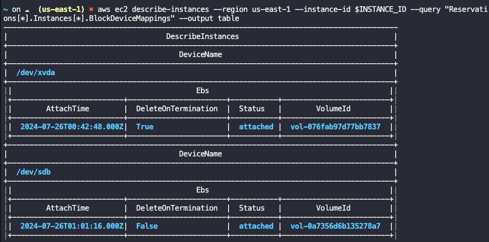
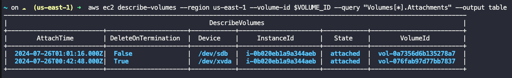

# Attach Volume to Ec2 Instance

# Scenerio

An instance named nautilus-ec2 and a volume named nautilus-volume already exists in us-east-1 region. Attach the nautilus-volume volume to the nautilus-ec2 instance, make sure to set the device name to /dev/sdb while attaching the volume.

## Solution

Get the Instance ID of EC2 and Volume ID and then attach to Ec2

```
# Get the Instance ID of nautilus-ec2
INSTANCE_ID=$(aws ec2 describe-instances --region us-east-1 --filters "Name=tag:Name,Values=nautilus-ec2" --query "Reservations[*].Instances[*].InstanceId" --output text)

# Get the Volume ID of nautilus-volume
VOLUME_ID=$(aws ec2 describe-volumes --region us-east-1 --filters "Name=tag:Name,Values=nautilus-volume" --query "Volumes[*].VolumeId" --output text)

# Attach the Volume to the Instance
aws ec2 attach-volume --region us-east-1 --instance-id $INSTANCE_ID --volume-id $VOLUME_ID --device /dev/sdb
```

## Verification

describe the instance's block devices:

```
aws ec2 describe-instances --region us-east-1 --instance-id $INSTANCE_ID --query "Reservations[*].Instances[*].BlockDeviceMappings" --output table
```



(or) You can describe Volumes

