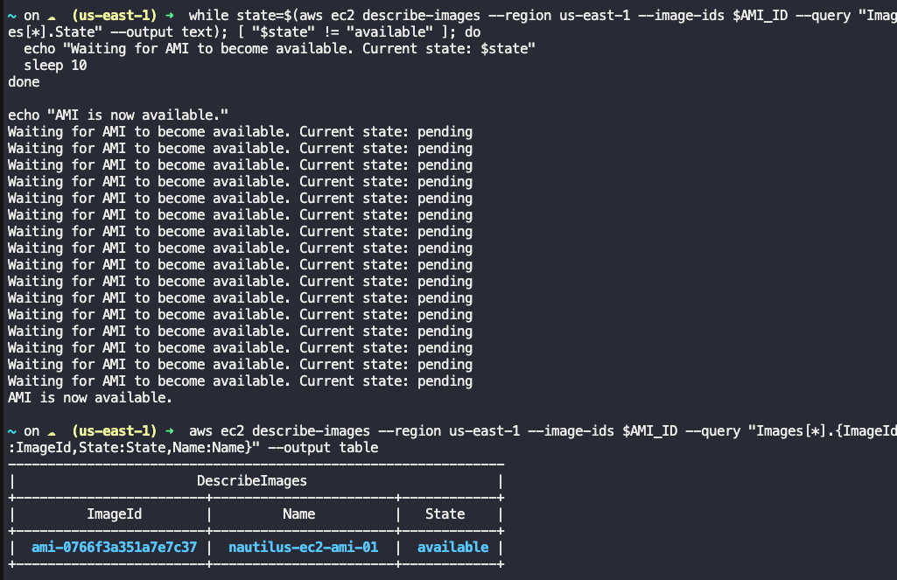

# Create an AMI from EC2 Instance

## Scenerio

- create an AMI from an existing EC2 instance named nautilus-ec2 with the following requirement:

- Name of the AMI should be nautilus-ec2-ami, make sure AMI is in available state.

### Solution

1. Get the Instance ID of nautilus-ec2
2. Create the AMI from the Instance:

```
# Get the Instance ID of nautilus-ec2
INSTANCE_ID=$(aws ec2 describe-instances --region us-east-1 --filters "Name=tag:Name,Values=nautilus-ec2" --query "Reservations[*].Instances[*].InstanceId" --output text)

# Create the AMI from the Instance
AMI_ID=$(aws ec2 create-image --region us-east-1 --instance-id $INSTANCE_ID --name "nautilus-ec2-ami" --no-reboot --query "ImageId" --output text)

# Wait for the AMI to become available
while state=$(aws ec2 describe-images --region us-east-1 --image-ids $AMI_ID --query "Images[*].State" --output text); [ "$state" != "available" ]; do
  echo "Waiting for AMI to become available. Current state: $state"
  sleep 10
done

echo "AMI is now available."

```

### **Note**

The **--no-reboot** option ensures that the instance is not rebooted when the image is created. If you prefer to reboot the instance to ensure a consistent state, you can omit this option.


### Verification

After the AMI is created and becomes available, you can verify its status with the following command:

```
aws ec2 describe-images --region us-east-1 --image-ids $AMI_ID --query "Images[*].{ImageId:ImageId,State:State,Name:Name}" --output table
```


